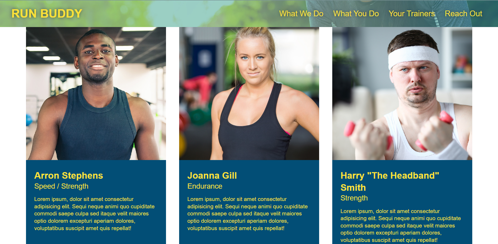

# Run-Buddy

## Built With 🧰
- HTML 
- CSS

## Work Completed
Building a website with HTML & CSS to fit a client mockup image. Work included:

- [x] HTML outlined, used semantic HTML
- [x] CSS added in hierarchical fashion, to meet design requiremetns
- [x] Form field added
- [x] Comments added in index.html and .css files for clarity around structure and function 
- [x] SEO + accessibility factors added: Meta Description, Meta Keywords, Title Tags, image alt text 

### Screenshot

